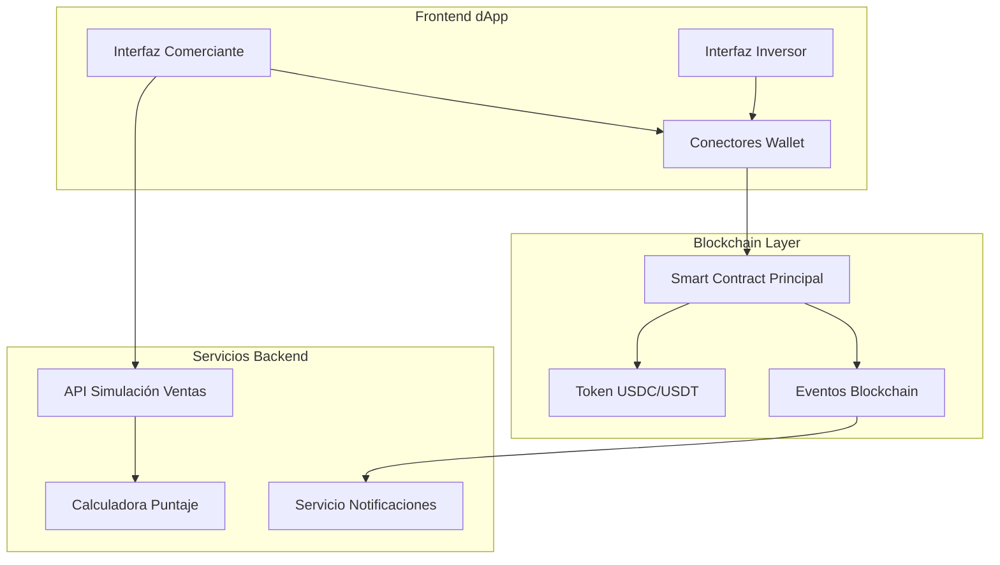

# Documento de Diseño - Solvi

## Visión General

"Solvi" es una plataforma DeFi que tokeniza la reputación crediticia de comerciantes LATAM para facilitar microcréditos instantáneos. El sistema utiliza datos de ventas verificables de sistemas de pago digitales para calcular puntajes de confianza y conectar comerciantes con inversores de forma descentralizada.

### Stack Tecnológico Seleccionado

- **Blockchain:** Polygon (MATIC) - Elegida por bajas comisiones y adopción en LATAM
- **Smart Contracts:** Solidity con OpenZeppelin para seguridad
- **Frontend:** React + TypeScript + Vite para desarrollo rápido
- **Wallet Integration:** Web3Modal para soporte multi-wallet
- **Stablecoins:** USDC y USDT en Polygon
- **Datos:** APIs simuladas para el MVP (futuro: integraciones reales con Mercado Pago, etc.)

## Arquitectura

### Arquitectura de Alto Nivel



### Flujo de Datos Principal

1. **Comerciante** conecta wallet y autoriza acceso a datos de ventas
2. **Sistema** calcula puntaje de confianza basado en historial simulado
3. **Comerciante** solicita préstamo dentro de su límite calculado
4. **Smart Contract** registra solicitud y la hace visible a inversores
5. **Inversor** revisa oportunidades y financia préstamos seleccionados
6. **Smart Contract** transfiere fondos automáticamente al comerciante

## Componentes y Interfaces

### 1. Interfaz del Comerciante

#### Componentes Principales:
- **Dashboard de Ventas:** Gráficos de ingresos diarios/semanales
- **Medidor de Confianza:** Visualización del puntaje 0-100
- **Calculadora de Préstamo:** Input con validación de límites
- **Estado de Solicitudes:** Tracking de préstamos activos

#### Interfaces Clave:
```typescript
interface ComercianteProfile {
  address: string;
  ventasHistorial: VentaData[];
  puntajeConfianza: number;
  limiteMaximo: number;
  prestamosActivos: Prestamo[];
}

interface VentaData {
  fecha: Date;
  monto: number;
  transacciones: number;
  plataforma: 'mercadopago' | 'uala' | 'getnet' | 'modo';
}
```

### 2. Interfaz del Inversor

#### Componentes Principales:
- **Lista de Oportunidades:** Grid de préstamos disponibles
- **Filtros de Riesgo:** Por puntaje, monto, plazo
- **Portfolio Tracker:** Seguimiento de inversiones activas
- **Calculadora de Rendimiento:** ROI estimado

#### Interfaces Clave:
```typescript
interface OportunidadPrestamo {
  id: string;
  comercianteAddress: string;
  puntajeConfianza: number;
  montoSolicitado: number;
  tasaInteres: number;
  plazoMeses: number;
  estado: 'disponible' | 'financiado' | 'completado';
}
```

### 3. Smart Contract Principal

#### Funciones Principales:
```solidity
contract AdelanteMicroCreditos {
    // Estructuras de datos
    struct Prestamo {
        address comerciante;
        address inversor;
        uint256 monto;
        uint256 tasaInteres;
        uint256 plazoMeses;
        uint256 fechaInicio;
        EstadoPrestamo estado;
    }
    
    // Funciones principales
    function solicitarPrestamo(uint256 monto, uint256 tasaInteres, uint256 plazo) external;
    function financiarPrestamo(uint256 prestamoId) external;
    function realizarPago(uint256 prestamoId, uint256 monto) external;
    function calcularIntereses(uint256 prestamoId) external view returns (uint256);
}
```

## Modelos de Datos

### 1. Modelo de Comerciante
```typescript
interface Comerciante {
  walletAddress: string;
  datosVentas: {
    plataforma: string;
    historialMeses: number;
    ventasPromedioDiarias: number;
    consistenciaFlujo: number; // 0-1
  };
  puntajeConfianza: number; // 0-100
  verificacionKYB: {
    completada: boolean;
    documentos: string[];
    fechaVerificacion?: Date;
  };
}
```

### 2. Modelo de Préstamo
```typescript
interface Prestamo {
  id: string;
  comerciante: string;
  inversor?: string;
  monto: number; // en USDC
  tasaInteres: number; // anual %
  plazoMeses: number;
  fechaSolicitud: Date;
  fechaAprobacion?: Date;
  estado: 'solicitado' | 'financiado' | 'activo' | 'completado' | 'default';
  pagosRealizados: Pago[];
}

interface Pago {
  fecha: Date;
  monto: number;
  transactionHash: string;
}
```

### 3. Algoritmo de Puntaje de Confianza

```typescript
function calcularPuntajeConfianza(datosVentas: VentaData[]): number {
  const factores = {
    consistencia: calcularConsistenciaVentas(datosVentas), // 40%
    volumen: calcularVolumenPromedio(datosVentas), // 30%
    crecimiento: calcularTendenciaCrecimiento(datosVentas), // 20%
    antiguedad: calcularAntiguedadCuenta(datosVentas) // 10%
  };
  
  return Math.min(100, 
    factores.consistencia * 0.4 +
    factores.volumen * 0.3 +
    factores.crecimiento * 0.2 +
    factores.antiguedad * 0.1
  );
}
```

## Manejo de Errores

### 1. Errores de Smart Contract
- **Fondos Insuficientes:** Validación antes de transacciones
- **Préstamo No Encontrado:** Verificación de existencia
- **Permisos Insuficientes:** Control de acceso por roles
- **Gas Insuficiente:** Estimación previa y alertas

### 2. Errores de Frontend
- **Wallet No Conectada:** Prompts de conexión
- **Red Incorrecta:** Detección automática y cambio a Polygon
- **Transacción Rechazada:** Manejo de cancelaciones del usuario
- **Datos de Ventas Inválidos:** Validación y mensajes claros

### 3. Manejo de Estados de Error
```typescript
interface ErrorState {
  tipo: 'wallet' | 'network' | 'transaction' | 'validation';
  mensaje: string;
  accionSugerida: string;
  recuperable: boolean;
}
```

## Estrategia de Testing

### 1. Testing de Smart Contracts
- **Unit Tests:** Hardhat + Chai para todas las funciones
- **Integration Tests:** Flujos completos de préstamo
- **Security Tests:** Slither para análisis estático
- **Gas Optimization:** Medición de costos por función

### 2. Testing de Frontend
- **Component Tests:** React Testing Library
- **E2E Tests:** Playwright para flujos críticos
- **Wallet Integration Tests:** Mocks de MetaMask
- **Responsive Tests:** Múltiples dispositivos

### 3. Testing de Integración
- **Blockchain Integration:** Tests con red local
- **API Simulation:** Mocks de datos de ventas
- **Error Scenarios:** Manejo de fallos de red
- **Performance Tests:** Carga de múltiples usuarios

## Consideraciones de Seguridad

### 1. Smart Contract Security
- **Reentrancy Protection:** OpenZeppelin ReentrancyGuard
- **Access Control:** Roles y permisos granulares
- **Integer Overflow:** SafeMath para operaciones
- **Front-running Protection:** Commit-reveal para transacciones sensibles

### 2. Frontend Security
- **Input Validation:** Sanitización de todos los inputs
- **XSS Protection:** Escape de contenido dinámico
- **Wallet Security:** Nunca almacenar claves privadas
- **HTTPS Only:** Todas las comunicaciones encriptadas

### 3. Datos y Privacidad
- **Minimización de Datos:** Solo almacenar lo necesario
- **Encriptación:** Datos sensibles encriptados
- **Anonimización:** Hashes para identificadores
- **GDPR Compliance:** Derecho al olvido implementado

## Optimizaciones de Performance

### 1. Blockchain
- **Batch Transactions:** Agrupar operaciones cuando sea posible
- **Gas Optimization:** Uso eficiente de storage vs memory
- **Event Indexing:** Eventos bien estructurados para queries
- **Layer 2:** Polygon para reducir costos

### 2. Frontend
- **Code Splitting:** Carga lazy de componentes
- **Caching:** React Query para datos de blockchain
- **Optimistic Updates:** UI responsiva antes de confirmación
- **Bundle Optimization:** Tree shaking y minificación

### 3. Datos
- **Local Storage:** Cache de datos no sensibles
- **Pagination:** Carga incremental de listas
- **Compression:** Compresión de payloads grandes
- **CDN:** Assets estáticos distribuidos